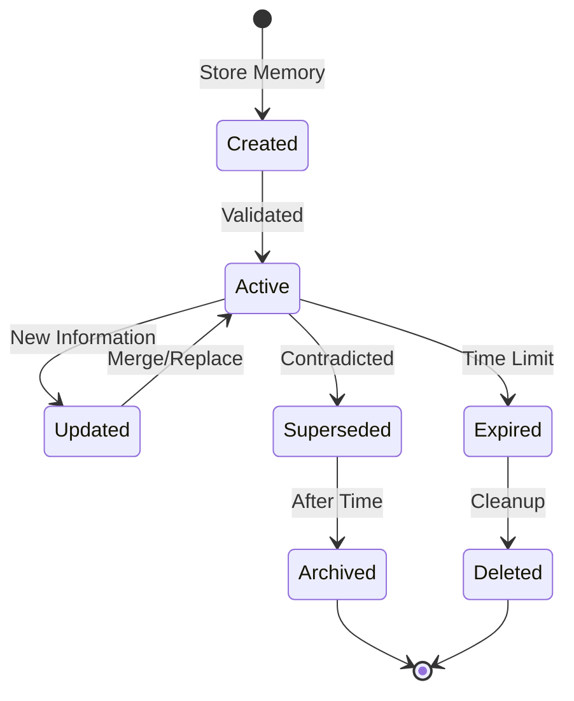

# Data Model

## Overview
This document defines the structure of memories and related entities in the Memento system.

## Core Entities

### Memory

The fundamental unit of information storage in Memento.

```typescript
interface Memory {
  // Identification
  id: string;                    // Unique identifier (e.g., "mem_abc123...")
  version: number;                // Version number for updates
  
  // Content
  content: string;                // The actual memory/fact
  embedding?: number[];           // Vector embedding for semantic search
  
  // Metadata
  subject: string;                // Primary subject (e.g., "Liam", "Emma")
  category: MemoryCategory;       // Type classification
  tags: string[];                 // Additional categorization
  
  // Trust & Validity
  confidence: number;             // Confidence score (0-1)
  source: MemorySource;           // How this memory was created
  superseded_by?: string;         // ID of memory that replaces this one
  supersedes?: string;            // ID of memory this replaces
  
  // Timestamps
  created_at: Date;               // When memory was created
  updated_at: Date;               // Last modification time
  accessed_at: Date;              // Last retrieval time
  expires_at?: Date;              // Optional expiration
  
  // Conversation Context
  conversation_id?: string;       // Which conversation created this
  message_id?: string;            // Specific message reference
}
```

### MemoryCategory

Enumeration of memory types for classification.

```typescript
enum MemoryCategory {
  PREFERENCE = "preference",       // Likes, dislikes, choices
  RESTRICTION = "restriction",     // Limitations, allergies, constraints  
  FACT = "fact",                  // Objective information
  SKILL = "skill",                // Abilities, knowledge level
  RELATIONSHIP = "relationship",   // Connections between people
  GOAL = "goal",                  // Objectives, plans
  HISTORY = "history",            // Past events, experiences
  CONTEXT = "context"             // Situational information
}
```

### MemorySource

How a memory was created or derived.

```typescript
enum MemorySource {
  EXPLICIT = "explicit",          // User said "remember that..."
  EXTRACTED = "extracted",        // LLM extracted from conversation
  INFERRED = "inferred",         // LLM inferred from context
  UPDATED = "updated",           // Modified version of existing memory
  SYSTEM = "system"              // System-generated metadata
}
```

## Relationships

### Memory Supersession Chain

Memories can form chains when information is updated:


## Storage Schema

### Vector Database Collections

```javascript
// Primary collection for all memories
{
  collection: "memories",
  schema: {
    id: "string",
    embedding: "vector[1536]",  // Assuming OpenAI ada-002
    metadata: {
      content: "string",
      subject: "string",
      category: "string",
      tags: "string[]",
      confidence: "float",
      created_at: "datetime",
      // ... other fields
    }
  }
}

// Index for subject-based queries
{
  collection: "subject_index",
  schema: {
    subject: "string",
    memory_ids: "string[]"
  }
}
```

## Data Operations

### Creating a Memory

```typescript
async function createMemory(input: CreateMemoryInput): Promise<Memory> {
  // 1. Generate ID
  const id = generateMemoryId();
  
  // 2. Generate embedding
  const embedding = await generateEmbedding(input.content);
  
  // 3. Check for duplicates/conflicts
  const similar = await findSimilarMemories(embedding, 0.95);
  if (similar.length > 0) {
    // Handle potential duplicate
  }
  
  // 4. Check for contradictions
  const contradictions = await findContradictions(input);
  if (contradictions.length > 0) {
    // Mark old memories as superseded
  }
  
  // 5. Store in vector DB
  const memory: Memory = {
    id,
    content: input.content,
    embedding,
    subject: normalizeSubject(input.subject),
    category: input.category,
    tags: input.tags || [],
    confidence: input.confidence || 1.0,
    source: input.source || MemorySource.EXPLICIT,
    created_at: new Date(),
    updated_at: new Date(),
    accessed_at: new Date(),
    version: 1
  };
  
  await vectorDB.add(memory);
  return memory;
}
```

### Searching Memories

```typescript
async function searchMemories(query: SearchQuery): Promise<Memory[]> {
  // 1. Generate query embedding
  const queryEmbedding = await generateEmbedding(query.text);
  
  // 2. Vector similarity search
  let results = await vectorDB.search({
    vector: queryEmbedding,
    limit: query.limit || 10,
    threshold: query.threshold || 0.7
  });
  
  // 3. Apply filters
  if (query.subject) {
    results = results.filter(m => m.subject === query.subject);
  }
  if (query.category) {
    results = results.filter(m => m.category === query.category);
  }
  
  // 4. Filter out superseded memories
  results = results.filter(m => !m.superseded_by);
  
  // 5. Update access time
  await updateAccessTime(results.map(m => m.id));
  
  return results;
}
```

## Memory Lifecycle



## Privacy & Multi-tenancy Considerations

### Namespace Isolation

For future multi-user support:

```typescript
interface NamespacedMemory extends Memory {
  namespace: string;  // User ID or workspace ID
  shared: boolean;    // Can be accessed across namespaces
  permissions: {
    read: string[];   // Who can read
    write: string[];  // Who can modify
  };
}
```

### Data Retention Policies

```typescript
interface RetentionPolicy {
  namespace: string;
  rules: {
    category: MemoryCategory;
    retention_days: number;
    archive_after_days?: number;
  }[];
}
```

## Performance Considerations

### Indexing Strategy
- Primary index on `id`
- Vector index on `embedding`
- Secondary indices on `subject`, `category`, `created_at`
- Composite index on `namespace` + `subject` for multi-tenant queries

### Caching Strategy
- Cache frequently accessed memories in Redis/memory
- Cache embedding generation for common phrases
- Cache search results for repeated queries within session

## Migration Path

As the system evolves, memories need versioning:

```typescript
interface MemoryMigration {
  from_version: number;
  to_version: number;
  migrate: (memory: any) => Memory;
}

// Example migration adding a new field
const migration_v1_to_v2: MemoryMigration = {
  from_version: 1,
  to_version: 2,
  migrate: (old) => ({
    ...old,
    importance: old.confidence, // New field with default
    version: 2
  })
};
```
