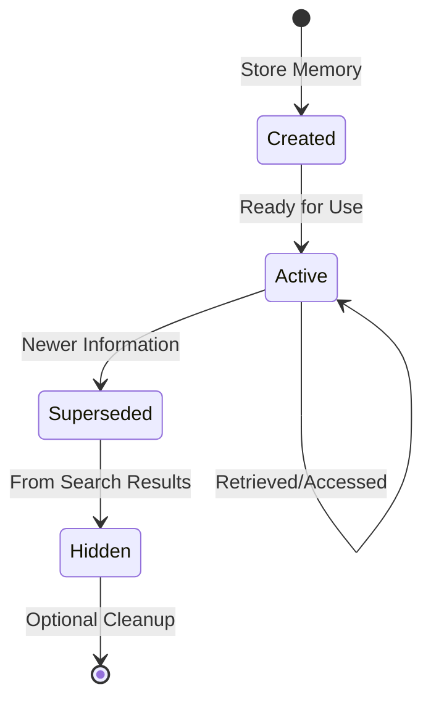

# Data Model

## Overview
This document defines the simplified structure of memories in the Memento system. The design prioritizes simplicity and flexibility, using natural language and semantic search rather than rigid categorization.

## Core Entity

### Memory

The fundamental unit of information storage in Memento.

```typescript
interface Memory {
  // Core Fields
  id: string;                    // Unique identifier (e.g., "mem_abc123...")
  content: string;                // Natural language memory/fact
  embedding: number[];            // Vector embedding for semantic search
  
  // Metadata
  confidence: number;             // Confidence score (0-1)
  source: 'explicit' | 'extracted';  // How memory was created
  
  // Conflict Tracking
  supersedes?: string;            // ID of memory this replaces
  superseded_by?: string;         // ID of memory that replaces this
  
  // Timestamps
  created_at: Date;               // When memory was created
  updated_at: Date;               // Last modification time
  accessed_at: Date;              // Last retrieval time
}
```

### Design Decisions

- **No Categories**: We use semantic search instead of predefined categories. The content itself determines what the memory is about.
- **No Tags**: Initially skipped for simplicity. Can be added later if needed.
- **Simple Source**: Just tracking whether user explicitly asked to remember ('explicit') or it was extracted from conversation ('extracted').
- **Conflict Tracking**: Built-in supersession support for handling outdated information.

## Relationships

### Memory Supersession Chain

Memories can form chains when information is updated over time:


When retrieving memories, superseded memories are automatically filtered out by default.

## Storage Schema

### Vector Database Collection

```javascript
{
  collection: "memories",
  schema: {
    // Main fields
    id: "string",                   // Primary key
    content: "string",              // The actual memory text
    embedding: "vector[1536]",      // OpenAI ada-002 embeddings
    
    // Metadata stored separately
    metadata: {
      confidence: "float",
      source: "string",
      supersedes: "string",
      superseded_by: "string",
      created_at: "datetime",
      updated_at: "datetime", 
      accessed_at: "datetime"
    }
  },
  
  // Indices for performance
  indices: [
    { field: "id", type: "primary" },
    { field: "embedding", type: "vector" },
    { field: "metadata.created_at", type: "btree" },
    { field: "metadata.superseded_by", type: "btree" }
  ]
}
```

## Data Operations

### Creating a Memory

```typescript
async function createMemory(
  content: string, 
  confidence: number = 1.0,
  source: 'explicit' | 'extracted' = 'extracted'
): Promise<Memory> {
  const memory: Memory = {
    id: generateMemoryId(),           // e.g., "mem_" + nanoid()
    content,
    embedding: await generateEmbedding(content),
    confidence,
    source,
    created_at: new Date(),
    updated_at: new Date(),
    accessed_at: new Date()
  };
  
  await vectorDB.add(memory);
  return memory;
}
```

### Searching Memories

```typescript
async function searchMemories(
  query: string, 
  limit: number = 5
): Promise<Memory[]> {
  // Generate query embedding
  const queryEmbedding = await generateEmbedding(query);
  
  // Vector similarity search
  const results = await vectorDB.search({
    vector: queryEmbedding,
    limit: limit * 2,  // Get extra to account for filtering
    threshold: 0.7
  });
  
  // Filter out superseded memories
  const active = results.filter(m => !m.superseded_by);
  
  // Update access time
  const now = new Date();
  for (const memory of active) {
    await vectorDB.update(memory.id, { 
      accessed_at: now 
    });
  }
  
  return active.slice(0, limit);
}
```

### Superseding Memories

```typescript
async function supersedeMemory(
  oldMemoryId: string, 
  newMemoryId: string
): Promise<void> {
  const now = new Date();
  
  // Update the old memory
  await vectorDB.update(oldMemoryId, { 
    superseded_by: newMemoryId,
    updated_at: now
  });
  
  // Update the new memory
  await vectorDB.update(newMemoryId, { 
    supersedes: oldMemoryId,
    updated_at: now
  });
}
```

## Memory Lifecycle



## Performance Considerations

### Indexing Strategy
- Primary index on `id` for direct lookups
- Vector index on `embedding` for similarity search
- Index on `superseded_by` for filtering active memories
- Index on `created_at` for recency queries

### Optimization Tips
- Batch embedding generation when possible
- Cache frequently accessed memories
- Consider pagination for large result sets
- Implement connection pooling for database

## Future Extensions

Potential fields to add later if needed:

```typescript
interface FutureMemoryExtensions {
  // Multi-tenancy
  namespace?: string;              // User or workspace ID
  
  // Additional metadata
  tags?: string[];                 // Flexible categorization
  importance?: number;             // Priority/importance score
  
  // Advanced features
  expires_at?: Date;               // Auto-expiry for temporal facts
  related_memories?: string[];    // Explicit relationships
  
  // Analytics
  access_count?: number;           // How often accessed
  last_modified_by?: string;      // Who/what modified it
}
```

## Privacy & Security Notes
- Consider encryption at rest for sensitive memory content
- Implement audit logging for all memory operations
