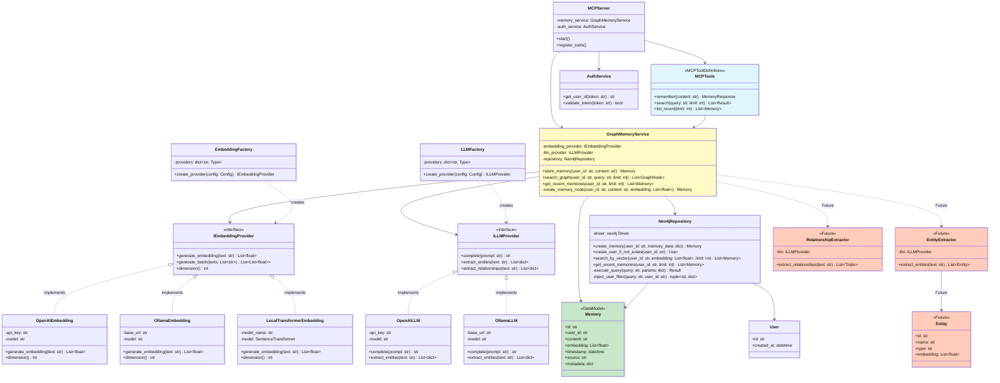

# Detailed Architecture

## Class Diagram

```mermaid
classDiagram
    class MCPServer {
        -memory_service: GraphMemoryService
        -auth_service: AuthService
        +start()
        +register_tools()
    }
    
    class MCPTools {
        <<MCPToolDefinitions>>
        +remember(content: str) MemoryResponse
        +search(query: str, limit: int) List~Result~
        +list_recent(limit: int) List~Memory~
    }
    
    class IEmbeddingProvider {
        <<interface>>
        +generate_embedding(text: str) List~float~
        +generate_batch(texts: List~str~) List~List~float~~
        +dimension() int
    }
    
    class ILLMProvider {
        <<interface>>
        +complete(prompt: str) str
        +extract_entities(text: str) List~dict~
        +extract_relationships(text: str) List~dict~
    }
    
    class GraphMemoryService {
        -embedding_provider: IEmbeddingProvider
        -llm_provider: ILLMProvider  
        -repository: Neo4jRepository
        +store_memory(user_id: str, content: str) Memory
        +search_graph(user_id: str, query: str, limit: int) List~GraphNode~
        +get_recent_memories(user_id: str, limit: int) List~Memory~
        -create_memory_node(user_id: str, content: str, embedding: List~float~) Memory
    }
    
    class Neo4jRepository {
        -driver: neo4j.Driver
        +create_memory(user_id: str, memory_data: dict) Memory
        +create_user_if_not_exists(user_id: str) User
        +search_by_vector(user_id: str, embedding: List~float~, limit: int) List~Memory~
        +get_recent_memories(user_id: str, limit: int) List~Memory~
        -execute_query(query: str, params: dict) Result
        -inject_user_filter(query: str, user_id: str) tuple~str, dict~
    }
    
    class Memory {
        <<DataModel>>
        +id: str
        +user_id: str
        +content: str
        +embedding: List~float~
        +timestamp: datetime
        +source: str
        +metadata: dict
    }
    
    class User {
        +id: str
        +created_at: datetime
    }
    
    class AuthService {
        +get_user_id(token: str) str
        +validate_token(token: str) bool
    }
    
    class EmbeddingFactory {
        +create_provider(config: Config) IEmbeddingProvider
        -providers: dict~str, Type~
    }
    
    class LLMFactory {
        +create_provider(config: Config) ILLMProvider
        -providers: dict~str, Type~
    }
    
    class OpenAIEmbedding {
        -api_key: str
        -model: str
        +generate_embedding(text: str) List~float~
        +dimension() int
    }
    
    class OllamaEmbedding {
        -base_url: str
        -model: str
        +generate_embedding(text: str) List~float~
        +dimension() int
    }
    
    class LocalTransformerEmbedding {
        -model_name: str
        -model: SentenceTransformer
        +generate_embedding(text: str) List~float~
        +dimension() int
    }
    
    class OpenAILLM {
        -api_key: str
        -model: str
        +complete(prompt: str) str
        +extract_entities(text: str) List~dict~
    }
    
    class OllamaLLM {
        -base_url: str
        -model: str
        +complete(prompt: str) str
        +extract_entities(text: str) List~dict~
    }
    
    class EntityExtractor {
        <<Future>>
        -llm: ILLMProvider
        +extract_entities(text: str) List~Entity~
    }
    
    class RelationshipExtractor {
        <<Future>>
        -llm: ILLMProvider
        +extract_relationships(text: str) List~Triple~
    }
    
    class Entity {
        <<Future>>
        +id: str
        +name: str
        +type: str
        +embedding: List~float~
    }
    
    MCPServer --> MCPTools
    MCPServer --> GraphMemoryService
    MCPServer --> AuthService
    MCPTools --> GraphMemoryService
    
    GraphMemoryService --> IEmbeddingProvider
    GraphMemoryService --> ILLMProvider
    GraphMemoryService --> Neo4jRepository
    GraphMemoryService --> Memory
    
    Neo4jRepository --> Memory
    Neo4jRepository --> User
    
    EmbeddingFactory ..> IEmbeddingProvider : creates
    LLMFactory ..> ILLMProvider : creates
    
    IEmbeddingProvider <|.. OpenAIEmbedding : implements
    IEmbeddingProvider <|.. OllamaEmbedding : implements
    IEmbeddingProvider <|.. LocalTransformerEmbedding : implements
    
    ILLMProvider <|.. OpenAILLM : implements
    ILLMProvider <|.. OllamaLLM : implements
    
    GraphMemoryService ..> EntityExtractor : Future
    GraphMemoryService ..> RelationshipExtractor : Future
    EntityExtractor --> Entity : Future
    
    style MCPTools fill:#e1f5fe
    style Memory fill:#c8e6c9
    style GraphMemoryService fill:#fff9c4
    style EntityExtractor fill:#ffccbc
    style RelationshipExtractor fill:#ffccbc
    style Entity fill:#ffccbc
```
