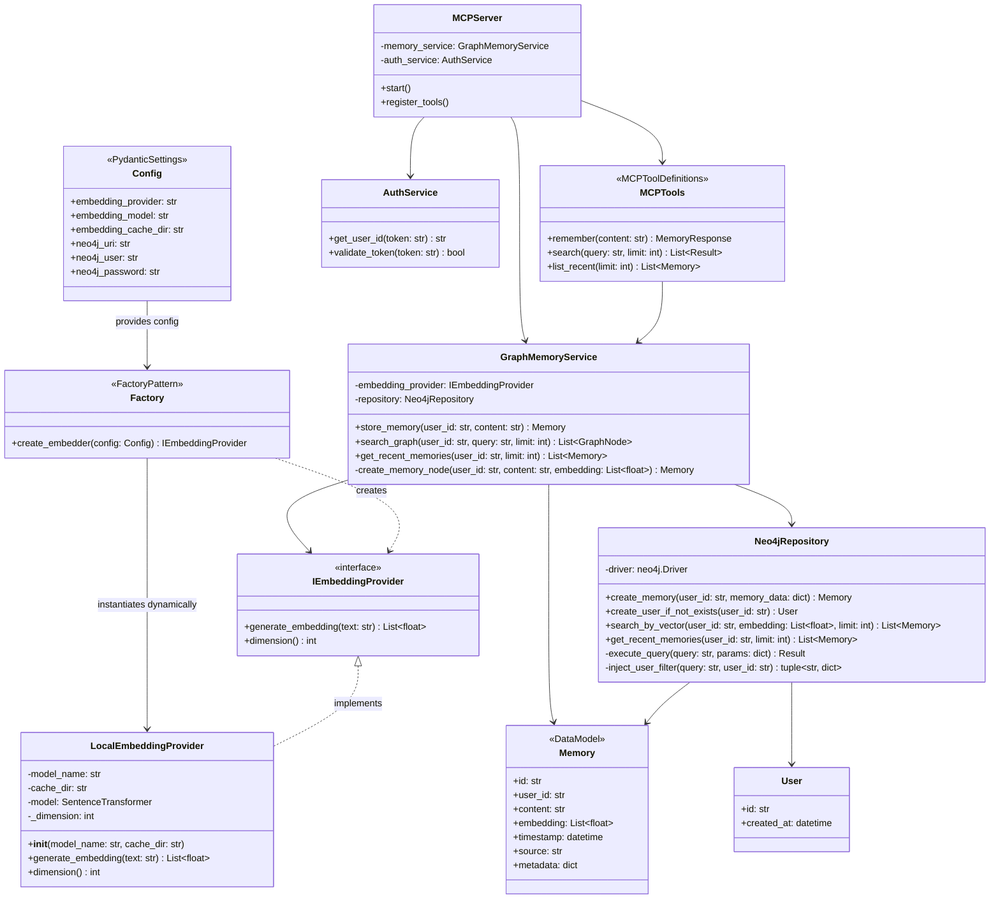

# Detailed Architecture

## Class Diagram

```mermaid
classDiagram
    class MCPServer {
        -memory_service: GraphMemoryService
        -auth_service: AuthService
        +start()
        +register_tools()
    }
    
    class MCPTools {
        <<MCPToolDefinitions>>
        +remember(content: str) MemoryResponse
        +search(query: str, limit: int) List~Result~
        +list_recent(limit: int) List~Memory~
    }
    
    class IEmbeddingProvider {
        <<interface>>
        +generate_embedding(text: str) List~float~
        +dimension() int
    }
    
    class GraphMemoryService {
        -embedding_provider: IEmbeddingProvider
        -repository: Neo4jRepository
        +store_memory(user_id: str, content: str) Memory
        +search_graph(user_id: str, query: str, limit: int) List~GraphNode~
        +get_recent_memories(user_id: str, limit: int) List~Memory~
        -create_memory_node(user_id: str, content: str, embedding: List~float~) Memory
    }
    
    class Neo4jRepository {
        -driver: neo4j.Driver
        +create_memory(user_id: str, memory_data: dict) Memory
        +create_user_if_not_exists(user_id: str) User
        +search_by_vector(user_id: str, embedding: List~float~, limit: int) List~Memory~
        +get_recent_memories(user_id: str, limit: int) List~Memory~
        -execute_query(query: str, params: dict) Result
        -inject_user_filter(query: str, user_id: str) tuple~str, dict~
    }
    
    class Memory {
        <<DataModel>>
        +id: str
        +user_id: str
        +content: str
        +embedding: List~float~
        +timestamp: datetime
        +source: str
        +metadata: dict
    }
    
    class User {
        +id: str
        +created_at: datetime
    }
    
    class AuthService {
        +get_user_id(token: str) str
        +validate_token(token: str) bool
    }
    
    class Config {
        <<PydanticSettings>>
        +embedding_provider: str
        +embedding_model: str
        +embedding_cache_dir: str
        +neo4j_uri: str
        +neo4j_user: str
        +neo4j_password: str
    }

    class Factory {
        <<FactoryPattern>>
        +create_embedder(config: Config) IEmbeddingProvider
    }

    class LocalEmbeddingProvider {
        -model_name: str
        -cache_dir: str
        -model: SentenceTransformer
        -_dimension: int
        +__init__(model_name: str, cache_dir: str)
        +generate_embedding(text: str) List~float~
        +dimension() int
    }

    MCPServer --> MCPTools
    MCPServer --> GraphMemoryService
    MCPServer --> AuthService
    MCPTools --> GraphMemoryService

    GraphMemoryService --> IEmbeddingProvider
    GraphMemoryService --> Neo4jRepository
    GraphMemoryService --> Memory

    Neo4jRepository --> Memory
    Neo4jRepository --> User

    Config --> Factory : provides config
    Factory ..> IEmbeddingProvider : creates
    Factory --> LocalEmbeddingProvider : instantiates dynamically

    IEmbeddingProvider <|.. LocalEmbeddingProvider : implements
```
