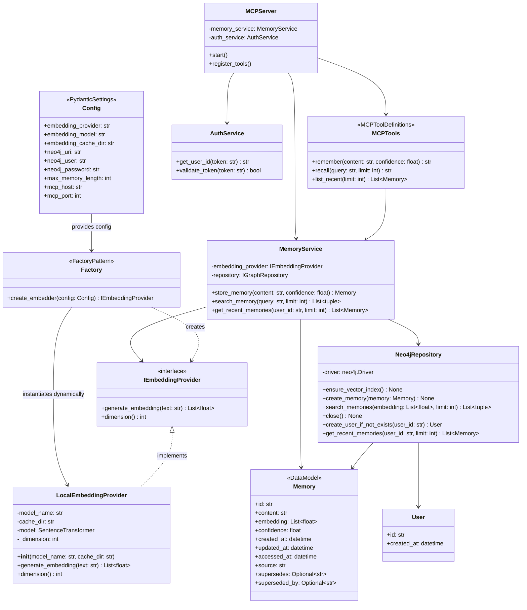

# Detailed Architecture

## Class Diagram

```mermaid
classDiagram
    class MCPServer {
        -memory_service: MemoryService
        -auth_service: AuthService
        +start()
        +register_tools()
    }
    
    class MCPTools {
        <<MCPToolDefinitions>>
        +remember(content: str, confidence: float) str
        +recall(query: str, limit: int) str
        +list_recent(limit: int) List~Memory~
    }
    
    class IEmbeddingProvider {
        <<interface>>
        +generate_embedding(text: str) List~float~
        +dimension() int
    }
    
    class MemoryService {
        -embedding_provider: IEmbeddingProvider
        -repository: IGraphRepository
        +store_memory(content: str, confidence: float) Memory
        +search_memory(query: str, limit: int) List~tuple~
        +get_recent_memories(user_id: str, limit: int) List~Memory~
    }
    
    class Neo4jRepository {
        -driver: neo4j.Driver
        +ensure_vector_index() None
        +create_memory(memory: Memory) None
        +search_memories(embedding: List~float~, limit: int) List~tuple~
        +close() None
        +create_user_if_not_exists(user_id: str) User
        +get_recent_memories(user_id: str, limit: int) List~Memory~
    }
    
    class Memory {
        <<DataModel>>
        +id: str
        +content: str
        +embedding: List~float~
        +confidence: float
        +created_at: datetime
        +updated_at: datetime
        +accessed_at: datetime
        +source: str
        +supersedes: Optional~str~
        +superseded_by: Optional~str~
    }
    
    class User {
        +id: str
        +created_at: datetime
    }
    
    class AuthService {
        +get_user_id(token: str) str
        +validate_token(token: str) bool
    }
    
    class Config {
        <<PydanticSettings>>
        +embedding_provider: str
        +embedding_model: str
        +embedding_cache_dir: str
        +neo4j_uri: str
        +neo4j_user: str
        +neo4j_password: str
        +max_memory_length: int
        +mcp_host: str
        +mcp_port: int
    }

    class Factory {
        <<FactoryPattern>>
        +create_embedder(config: Config) IEmbeddingProvider
    }

    class LocalEmbeddingProvider {
        -model_name: str
        -cache_dir: str
        -model: SentenceTransformer
        -_dimension: int
        +__init__(model_name: str, cache_dir: str)
        +generate_embedding(text: str) List~float~
        +dimension() int
    }

    MCPServer --> MCPTools
    MCPServer --> MemoryService
    MCPServer --> AuthService
    MCPTools --> MemoryService

    MemoryService --> IEmbeddingProvider
    MemoryService --> Neo4jRepository
    MemoryService --> Memory

    Neo4jRepository --> Memory
    Neo4jRepository --> User

    Config --> Factory : provides config
    Factory ..> IEmbeddingProvider : creates
    Factory --> LocalEmbeddingProvider : instantiates dynamically

    IEmbeddingProvider <|.. LocalEmbeddingProvider : implements
```
