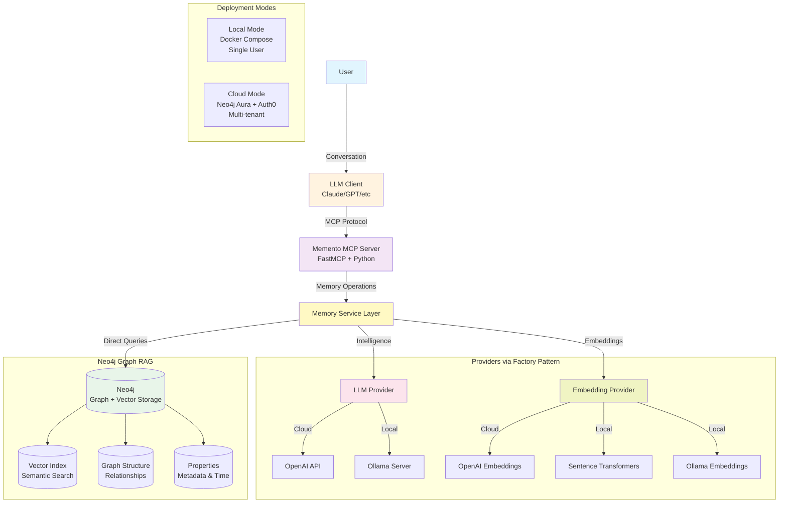

# Memento: Long-Term Memory for LLMs

## Overview
Memento provides Large Language Models with persistent, intelligent memory capabilities through the Model Context Protocol (MCP). It enables LLMs to remember facts across conversations, update their knowledge over time, and retrieve relevant information when needed.

## 🎯 Vision
Transform stateless LLM interactions into continuous, personalized relationships by giving AI assistants the ability to learn and remember over time.

## 🏗️ High-Level Architecture



## 🚀 Quick Start

TODO

## 📁 Project Structure

```
memento/
├── Documentation/          # Project documentation
├── src/
│   ├── mcp-server/        # MCP server implementation
│   ├── memory-store/      # Vector DB abstraction
│   └── utils/             # Shared utilities
└── tests/                 # Test suites
```

## 🎮 Core Features

### Current (MVP)
- ✅ Store factual memories with metadata
- ✅ Semantic search across all memories
- ✅ List recent memories
- ✅ Basic relevance scoring

### Roadmap
- 🔄 Memory updates and contradiction resolution
- 🏷️ Memory categorization and namespaces  
- 🧠 Memory synthesis and insight generation
- 📊 Memory lifecycle management (importance decay, consolidation)
- 🔐 Multi-tenant support

## 📚 Documentation

- [Sample Use Cases](Documentation/sample-use-cases.md) - See Memento in action
- [MCP Tool Specification](Documentation/mcp-tool-specification.md) - API contract
- [Data Model](Documentation/data-model.md) - Memory structure details
- [Architecture Decisions](Documentation/ADR/) - Key design rationale

## 🛠️ Technology Stack

- **MCP Server**: Python + FastMCP
- **Database**: Neo4j (graph + vectors)
- **LLM**: Local (Ollama/llama.cpp) or API (OpenAI/Anthropic)
- **Embeddings**: Local transformers or API (OpenAI/Anthropic)
- **Auth (Cloud)**: Auth0 OAuth 2.1
- **Testing**: Python pytest + MCP test harness

## 📝 License

MIT

## 🤝 Contributing

This is an early-stage project. Contributions and feedback welcome!
