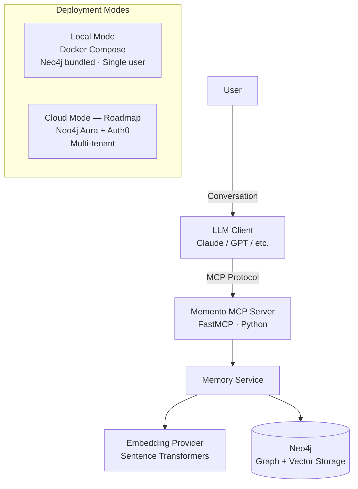

# Memento: Long-Term Memory for LLMs

## Overview
Memento provides Large Language Models with persistent, intelligent memory capabilities through the Model Context Protocol (MCP). It enables LLMs to remember facts across conversations, update their knowledge over time, and retrieve relevant information when needed.

## 🎯 Vision
Transform stateless LLM interactions into continuous, personalized relationships by giving AI assistants the ability to learn and remember over time.

## 🏗️ High-Level Architecture


```mermaid
graph TB
    User[User] -->|Conversation| Client[LLM Client<br/>Claude / GPT / etc.]
    Client -->|MCP Protocol| MCP[Memento MCP Server<br/>FastMCP · Python]

    MCP --> MS[Memory Service]
    MS --> EMB[Embedding Provider<br/>Sentence Transformers]
    MS --> Neo4j[(Neo4j<br/>Graph + Vector Storage)]

    subgraph "Deployment Modes"
        LocalMode[Local Mode<br/>Docker Compose<br/>Neo4j bundled · Single user]
        CloudMode[Cloud Mode — Roadmap<br/>Neo4j Aura + Auth0<br/>Multi-tenant]
    end
```

## 🚀 Quick Start

### Prerequisites

- Python 3.10+
- [uv](https://docs.astral.sh/uv/) (installed automatically in the dev container)
- Neo4j 5.11+ with vector index support ([Neo4j Aura Free](https://neo4j.com/cloud/platform/aura-graph-database/) works)

### 1. Install dependencies

```bash
uv sync
```

### 2. Configure environment

```bash
cp .env.example .env
```

Edit `.env` and fill in your Neo4j credentials — the three required fields:

```
MEMENTO_NEO4J_URI=neo4j+s://xxxxx.databases.neo4j.io
MEMENTO_NEO4J_USER=neo4j
MEMENTO_NEO4J_PASSWORD=your-password-here
```

All other fields have defaults and can be left as-is.

### 3. Start the MCP server

```bash
uv run python -m src.mcp.server
```

The first run downloads the `all-MiniLM-L6-v2` embedding model (~80MB) to `.cache/models/`. It also creates the Neo4j vector index and uniqueness constraint automatically. The server listens at `http://0.0.0.0:8000/mcp`.

### 4. Test with MCP Inspector

Install and run the [MCP Inspector](https://github.com/modelcontextprotocol/inspector) on your host machine:

```bash
npx @modelcontextprotocol/inspector
```

Connect it to: `http://localhost:8000/mcp`

Two tools are available:
- **`remember`** — stores a memory. Params: `content` (string), `confidence` (float 0–1)
- **`recall`** — semantic search over stored memories. Params: `query` (string), `limit` (int, default 10)

### Running in the dev container

Run the server inside the container as normal. Port 8000 is declared in `devcontainer.json` (`forwardPorts`) so it is forwarded to your host automatically by your IDE (PyCharm, VS Code, etc). The MCP Inspector on your host can then reach `http://localhost:8000/mcp`.

> **Note**: If you rebuild the container, PyCharm may need a moment to re-establish port forwarding after the container starts.

### Running tests

```bash
uv run pytest                                         # all tests
uv run pytest --cov=src --cov-report=term-missing     # with coverage
```

All tests use mocks — no Neo4j connection or embedding model required.

## 📁 Project Structure

```
memento/
├── Documentation/          # Project documentation
│   ├── ADR/               # Architecture Decision Records
│   └── legacy/            # Superseded documentation
├── specs/                 # Feature specifications
│   └── 001-baseline-rag/
├── src/
│   ├── models/            # Shared domain models (Memory, User)
│   ├── embeddings/        # Embedding provider implementations
│   ├── memory/            # Memory service layer
│   ├── graph/             # Neo4j repository layer
│   ├── mcp/               # MCP server implementation
│   └── utils/             # Shared utilities (config, factory)
└── tests/
    ├── test_embeddings/
    ├── test_graph/
    ├── test_mcp/
    ├── test_memory/
    ├── test_models/
    └── test_utils/
```

## 🎮 Core Features

### Current (MVP)
- ✅ Store factual memories with metadata
- ✅ Semantic search across all memories
- ✅ Basic relevance scoring

### Roadmap
- 📋 List recent memories
- 🔄 Memory updates and contradiction resolution
- 🏷️ Memory categorization and namespaces
- 🧠 Memory synthesis and insight generation
- 📊 Memory lifecycle management (importance decay, consolidation)
- 🔐 Multi-tenant support with Auth0

## 📚 Documentation

- [Sample Use Cases](Documentation/sample-use-cases.md) - See Memento in action
- [MCP Tool Specification](Documentation/legacy/mcp-tool-specification.md) - API contract
- [Data Model](Documentation/legacy/data-model.md) - Memory structure details
- [Architecture Decisions](Documentation/ADR/) - Key design rationale

## 🛠️ Technology Stack

- **MCP Server**: Python + FastMCP
- **Database**: Neo4j (graph + vectors)
- **Embeddings**: Sentence Transformers (local)
- **Auth (Cloud — Roadmap)**: Auth0 OAuth 2.1
- **Testing**: pytest

## 📝 License

MIT

## 🤝 Contributing

This is an early-stage project. Contributions and feedback welcome!
