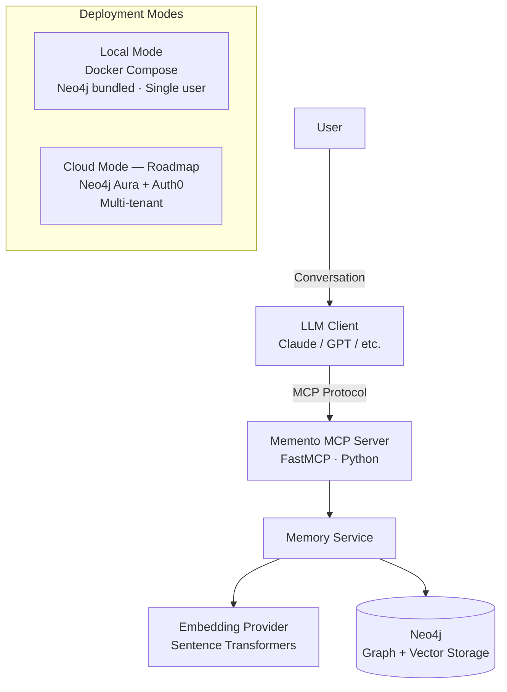

# Memento: Long-Term Memory for LLMs

## Overview
Memento provides Large Language Models with persistent, intelligent memory capabilities through the Model Context Protocol (MCP). It enables LLMs to remember facts across conversations, update their knowledge over time, and retrieve relevant information when needed.

## Vision
Transform stateless LLM interactions into continuous, personalized relationships by giving AI assistants the ability to learn and remember over time.

## Architecture


```mermaid
graph TB
    User[User] -->|Conversation| Client[LLM Client<br/>Claude / GPT / etc.]
    Client -->|MCP Protocol| MCP[Memento MCP Server<br/>FastMCP · Python]

    MCP --> MS[Memory Service]
    MS --> EMB[Embedding Provider<br/>Sentence Transformers]
    MS --> Neo4j[(Neo4j<br/>Graph + Vector Storage)]

    subgraph "Deployment Modes"
        LocalMode[Local Mode<br/>Docker Compose<br/>Neo4j bundled · Single user]
        CloudMode[Cloud Mode — Roadmap<br/>Neo4j Aura + Auth0<br/>Multi-tenant]
    end
```

---

## Power-User Setup

> **Use this if you want to *run* Memento** as a memory backend for your MCP client (Claude Code, Claude Desktop, etc.). No Python toolchain required — just Docker. If you instead want to make code changes to Memento, see [Developer Setup](#developer-setup) below.

**Requirements**: Docker.

```bash
git clone https://github.com/rigrergl/memento.git
cd memento
cp .env.example .env
# Edit .env and set MEMENTO_NEO4J_PASSWORD (Neo4j requires 8+ characters).
# Recommended: pick a unique password rather than reusing one from elsewhere.
docker compose up -d
```

This pulls `ghcr.io/rigrergl/memento:v0.0.2` and a Neo4j instance, wires them together using the password from your `.env`, and starts the Memento HTTP server at `http://localhost:8000/mcp/`.

> The compose file has no fallback password — `docker compose up` will fail loudly if `MEMENTO_NEO4J_PASSWORD` is unset. This is deliberate: shipping a hard-coded default would create a shared credential across every Memento deployment.

### MCP client configuration

Wire your MCP client to the running Memento server using one of the three options below.

#### Option 1 — Native HTTP (recommended for Claude Code and other modern clients)

```json
{
  "mcpServers": {
    "memento": {
      "type": "http",
      "url": "http://localhost:8000/mcp/"
    }
  }
}
```

**Claude Code**: native HTTP is supported. **Claude Desktop**: use a bridge (options 2 or 3 below).

#### Option 2 — Bridge via `mcp-remote` (for stdio-only clients with Node/npm)

> **Third-party bridge** — not authored or maintained by this project.

```json
{
  "mcpServers": {
    "memento": {
      "command": "npx",
      "args": ["-y", "mcp-remote", "http://localhost:8000/mcp/"]
    }
  }
}
```

#### Option 3 — Bridge via `mcp-proxy` (for stdio-only clients with Python/uv)

> **Third-party bridge** — not authored or maintained by this project.

```json
{
  "mcpServers": {
    "memento": {
      "command": "uvx",
      "args": ["mcp-proxy", "http://localhost:8000/mcp/"]
    }
  }
}
```

### Upgrade

```bash
git pull && docker compose pull && docker compose up -d
```

Two tools are available:
- **`remember`** — stores a memory. Params: `content` (string), `confidence` (float 0–1)
- **`recall`** — semantic search over stored memories. Params: `query` (string), `limit` (int, default 10)

---

## Developer Setup

> **Use this only if you want to make code changes to Memento itself** (contribute, debug, or experiment with the server's internals). It runs Memento natively via `uv` so edits hot-reload, and uses Docker only for Neo4j. If you just want to *use* Memento as a memory backend for your LLM client, follow [Power-User Setup](#power-user-setup) instead.

**Requirements**: [uv](https://docs.astral.sh/uv/), Docker.

```bash
uv sync
cp .env.example .env
# Edit .env and set MEMENTO_NEO4J_PASSWORD (Neo4j requires 8+ characters).
docker compose up neo4j -d
set -a; source .env; set +a
```

Then open Claude Code or Gemini CLI from the repo root. The project-level `.mcp.json` automatically wires two MCP servers:

- **`memento`** — runs `uv run fastmcp run src/mcp/server.py --reload` (edits to tool source are picked up on the next call after the client respawns the subprocess)
- **`neo4j-cypher`** — connects `mcp-neo4j-cypher` to the same Neo4j instance for direct Cypher queries during development

### Running tests

```bash
uv run pytest                                         # all tests
uv run pytest --cov=src --cov-report=term-missing     # with coverage
```

All tests use mocks — no Neo4j connection or embedding model required.

---

## Project Structure

```
memento/
├── Documentation/          # Project documentation
│   ├── ADR/               # Architecture Decision Records
│   └── legacy/            # Superseded documentation
├── specs/                 # Feature specifications
│   ├── 001-baseline-rag/
│   └── 002-container-setup/
├── src/
│   ├── models/            # Shared domain models (Memory, User)
│   ├── embeddings/        # Embedding provider implementations
│   ├── memory/            # Memory service layer
│   ├── graph/             # Neo4j repository layer
│   ├── mcp/               # MCP server implementation
│   └── utils/             # Shared utilities (config, factory)
└── tests/
    ├── test_embeddings/
    ├── test_graph/
    ├── test_mcp/
    ├── test_memory/
    ├── test_models/
    └── test_utils/
```

## Core Features

### Current (MVP)
- Store factual memories with metadata
- Semantic search across all memories
- Basic relevance scoring

### Roadmap
- List recent memories
- Memory updates and contradiction resolution
- Memory categorization and namespaces
- Memory synthesis and insight generation
- Memory lifecycle management (importance decay, consolidation)
- Multi-tenant support with Auth0

## Documentation

- [Sample Use Cases](Documentation/sample-use-cases.md) - See Memento in action
- [MCP Tool Specification](Documentation/legacy/mcp-tool-specification.md) - API contract
- [Data Model](Documentation/legacy/data-model.md) - Memory structure details
- [Architecture Decisions](Documentation/ADR/) - Key design rationale

## Technology Stack

- **MCP Server**: Python + FastMCP
- **Database**: Neo4j (graph + vectors)
- **Embeddings**: Sentence Transformers (local, baked into image)
- **Container**: Docker (multi-arch `linux/amd64` + `linux/arm64`)
- **Auth (Cloud — Roadmap)**: Auth0 OAuth 2.1
- **Testing**: pytest

## License

MIT

## Contributing

This is an early-stage project. Contributions and feedback welcome!
